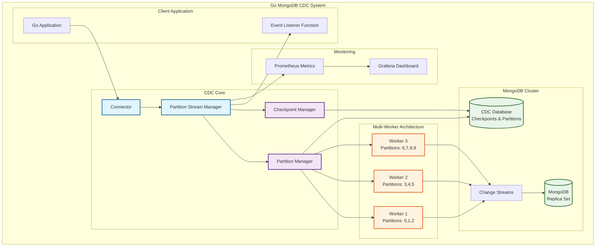

# Go MongoDB Change Data Capture (CDC)

Go MongoDB CDC is a high-performance library that captures and processes real-time changes in your MongoDB database. This library monitors data changes using MongoDB Change Streams API and processes these changes in a scalable manner.

## 📋 Table of Contents

- [Features](#features)
- [Installation](#installation)
- [Quick Start](#quick-start)
- [Configuration](#configuration)
- [Architecture](#architecture)
- [Monitoring and Metrics](#monitoring-and-metrics)
- [Docker Usage](#docker-usage)
- [API Reference](#api-reference)

## ✨ Features

- **Real-time Data Capture**: Instantly captures INSERT, UPDATE, DELETE, and REPLACE operations using MongoDB Change Streams
- **Scalable Partition System**: Intelligent partition management that distributes workload across multiple workers
- **Automatic Failover**: Automatic partition transfer and load balancing between workers
- **Resume Token Support**: Ability to resume from where it left off after system interruptions
- **Bootstrap Mode**: Full collection scanning feature for processing existing data for the first time
- **Prometheus Metrics**: Detailed performance and system metrics
- **Flexible Configuration**: Easy configuration with YAML and JSON files
- **Reliable Checkpoint System**: Advanced checkpoint mechanism to prevent data loss
- **Replica Set and Sharded Cluster Support**: Works with both single replica sets and sharded clusters

## 🚀 Installation

```bash
go get github.com/Trendyol/go-mongo-cdc
```

## ⚡ Quick Start

### 1. Basic Usage

```go
package main

import (
    "context"
    "log"
    "time"

    cdc "github.com/Trendyol/go-mongo-cdc"
    "github.com/Trendyol/go-mongo-cdc/config"
    "github.com/Trendyol/go-mongo-cdc/mongo/message"
    "github.com/Trendyol/go-mongo-cdc/stream"
    "go.uber.org/zap"
)

func main() {
    logger, _ := zap.NewDevelopment()
    defer logger.Sync()

    cfg := config.Config{
        Host:       "localhost",
        Port:       27017,
        Database:   "myDB",
        Collection: "myCollection",
        Logger: config.LoggerConfig{
            Logger: logger,
        },
    }

    connector, err := cdc.NewConnector(context.Background(), cfg, processChangeEvent)
    if err != nil {
        log.Fatal("Failed to create CDC connector:", err)
    }
    defer connector.Close()

    connector.Start(context.Background())
}

func processChangeEvent(ctx *stream.ListenerContext) error {
    switch ctx.Message.OperationType {
    case message.OperationInsert:
        log.Printf("New document inserted: %+v", ctx.Message.FullDocument)
    case message.OperationUpdate:
        log.Printf("Document updated: %+v", ctx.Message.FullDocument)
    case message.OperationDelete:
        log.Printf("Document deleted: %+v", ctx.Message.DocumentID)
    }

    return ctx.Ack()
}
```

### 2. Configuration File Usage

**config.yaml:**
```yaml
host: localhost
port: 27017
database: myDB
collection: myCollection
username: myUser
password: myPassword
authDatabase: admin

metric:
  port: 8080

checkpoint:
  collection: "cdc_checkpoints"
  saveInterval: 30s

partition:
  heartbeatInterval: 5s
  workerTimeout: 30s
  partitionDatabase: "cdc_partitions"
  refreshInterval: 30s

logger:
  logLevel: 1
```

```go
connector, err := cdc.NewConnectorWithConfigFile(
    context.Background(),
    "config.yaml",
    processChangeEvent,
)
```

## ⚙️ Configuration

### Config Struct

| Field | Type | Description | Default |
|-------|------|-------------|---------|
| `Host` | string | MongoDB host address | - |
| `Port` | int | MongoDB port number | 27017 |
| `Username` | string | MongoDB username | - |
| `Password` | string | MongoDB password | - |
| `Database` | string | Database to monitor | - |
| `Collection` | string | Collection to monitor | - |
| `AuthDatabase` | string | Authentication database | admin |

### Metric Configuration

| Field | Type | Description | Default |
|-------|------|-------------|---------|
| `Port` | int | Prometheus metrics port | 8080 |

### Checkpoint Configuration

| Field | Type | Description | Default |
|-------|------|-------------|---------|
| `Collection` | string | Checkpoint collection name | cdc_checkpoints |
| `SaveInterval` | duration | Token save interval | 30s |

### Partition Configuration

| Field | Type | Description | Default |
|-------|------|-------------|---------|
| `HeartbeatInterval` | duration | Worker heartbeat interval | 5s |
| `WorkerTimeout` | duration | Worker timeout duration | 30s |
| `PartitionDatabase` | string | Partition database | cdc_partitions |
| `RefreshInterval` | duration | Partition refresh interval | 30s |
| `RuntimeFiltering` | bool | MongoDB CPU yükünü azaltmak için runtime filtreleme | false |

**RuntimeFiltering Açıklaması:**
- `false` (varsayılan): MongoDB seviyesinde partition filtreleme yapılır (daha az network trafiği, daha fazla MongoDB CPU kullanımı)
- `true`: Runtime'da partition filtreleme yapılır (daha fazla network trafiği, daha az MongoDB CPU kullanımı)
- Çok sayıda change stream (50+) kullanıyorsanız `true` yapmanız önerilir

## 🏗️ Architecture

Go MongoDB CDC consists of the following core components:



### Components

1. **Connector**: Main component that manages the entire system
2. **Partition Manager**: Manages partition distribution between workers
3. **Stream Manager**: Manages MongoDB Change Streams
4. **Checkpoint Manager**: Stores resume tokens and progress state
5. **Metric System**: Provides Prometheus metrics

### Partition System

The system divides the data load into 10 partitions. Each partition is determined based on the hash value of document IDs. This enables:

- Parallel processing capability
- Automatic load balancing
- Failover between workers
- Scalable performance

### Bootstrap Process

When run for the first time, the system:

1. Scans all existing documents
2. Processes each document as a synthetic INSERT event
3. Starts tracking real-time changes after bootstrap completion
4. Resumes from where it left off if interrupted during bootstrap

## 📊 Monitoring and Metrics

The system provides the following Prometheus metrics:

### Core Metrics

- `go_mongo_cdc_insert_total`: Total number of INSERT operations
- `go_mongo_cdc_update_total`: Total number of UPDATE operations
- `go_mongo_cdc_delete_total`: Total number of DELETE operations
- `go_mongo_cdc_process_latency_current`: Current processing latency
- `go_mongo_cdc_cdc_latency_current`: Current CDC latency
- `go_mongo_cdc_build_info`: Build information

### Metrics Endpoint

The metrics endpoint runs at `:8080/metrics` by default.

```bash
curl http://localhost:8080/metrics
```

## 🐳 Docker Usage

### MongoDB Replica Set Setup

```yaml
version: '3.8'
services:
  mongodb:
    image: mongo:6.0
    container_name: my-mongo
    restart: always
    ports:
      - "27017:27017"
    volumes:
      - mongo-data:/data/db
    command: --replSet rs0 --bind_ip_all --noauth

  mongodb-init:
    image: mongo:6.0
    depends_on:
      - mongodb
    command: >
      bash -c "
        echo 'Waiting for MongoDB to start...' &&
        sleep 15 &&
        mongosh mongodb://mongodb:27017/admin --eval \"
          rs.initiate({
            _id: 'rs0',
            members: [{
              _id: 0,
              host: 'localhost:27017'
            }]
          })
        \"
      "

volumes:
  mongo-data:
```

### Usage

```bash
# Start MongoDB
docker-compose up -d

# Run the application
go run main.go
```

## 🛠️ Development

### Requirements

- Go 1.24.2+
- MongoDB 4.0+ (Replica Set or Sharded Cluster)

### Build

```bash
# Install dependencies
go mod tidy

# Run tests
make test

# Run linter
make lint

# Run linter with fixes
make linter
```

### Testing

```bash
# Run all tests
go test ./...

# Run benchmark tests
go test ./... -bench . -benchmem
```

## 🔧 Troubleshooting

### Common Issues

1. **"MongoDB is not running as a replica set" Error**
   - Start MongoDB in replica set mode
   - Use `--replSet` parameter when starting

2. **"Failed to acquire partitions" Error**
   - Check MongoDB connection
   - Verify worker timeout settings

3. **High Memory Usage**
   - Normal during bootstrap process
   - Lower the `saveInterval` value

## 📄 API Reference

### Connector Interface

```go
type Connector interface {
    Start(ctx context.Context)
    Close()
}
```

### ListenerFunc

```go
type ListenerFunc func(ctx *ListenerContext) error

type ListenerContext struct {
    Message     message.Message
    PartitionID int
    Ack         func() error
}
```

### Message Struct

```go
type Message struct {
    OperationType OperationType
    ClusterTime   primitive.Timestamp
    Database      string
    Collection    string
    DocumentID    interface{}
    FullDocument  bson.M
    OldDocument   bson.M
    EventTime     time.Time
}
```